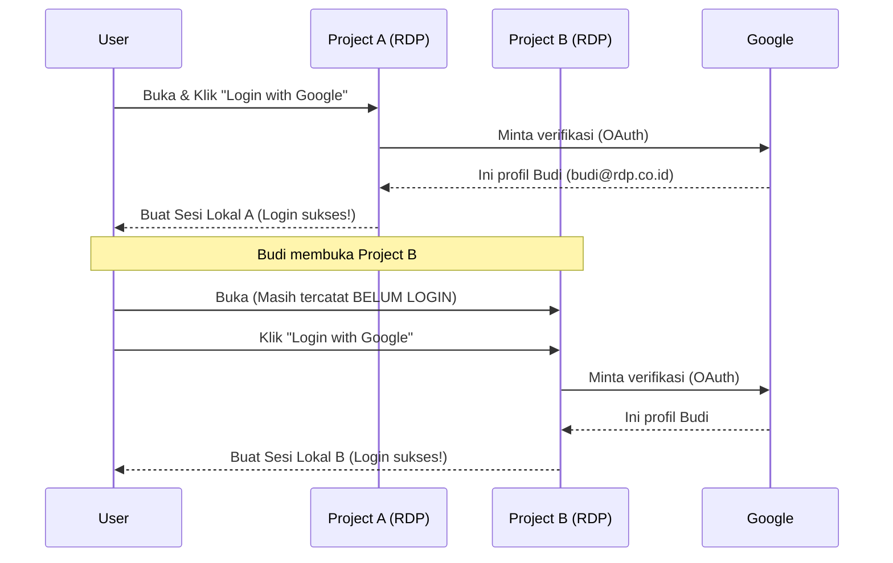
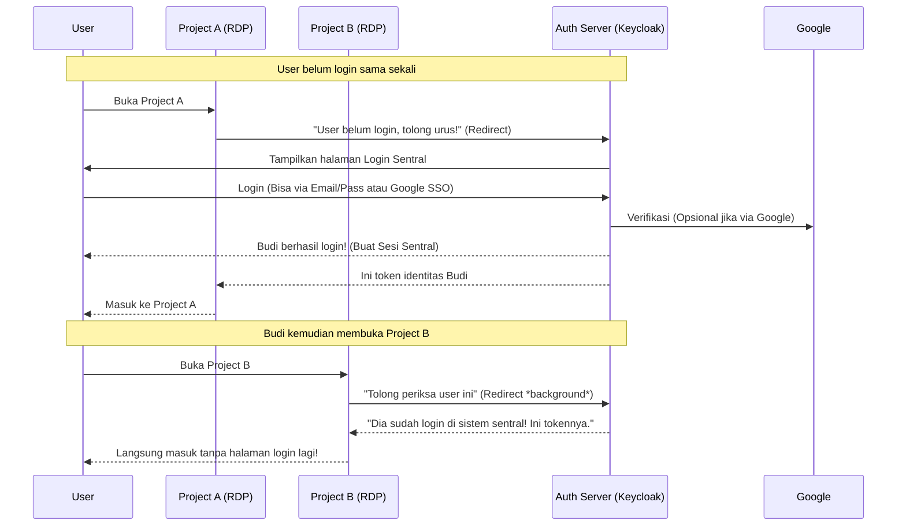

# Arsitektur Centralized Identity Server

Dokumen ini memaparkan skema, konsep, serta estimasi *effort* (usaha) jika kita ingin menerapkan sistem **Centralized Identity Server** (Single Session) melintasi beberapa proyek RDP.

---

## 1. Perbedaan Mendasar

### A. Arsitektur Saat Ini (Decentralized Sessions dengan Google SSO)
Saat ini, *Starter Kit* menggunakan pola di mana Google hanya bertindak sebagai "Pemberi Stempel Identitas" (Identity Provider).

### B. Arsitektur Centralized Identity Server (Single Session)
Dalam arsitektur ini, kita meletakkan **satu server tambahan khusus** (misalnya menggunakan *Keycloak* atau *Authelia*) di tengah-tengah. Server inilah yang mengatur _session_ (sesi) login. Proyek A dan Proyek B tidak memiliki halaman form _login_ sendiri, melainkan "menitipkan" proses login ke peladen sentral ini.

---

## 2. Kelebihan dan Kekurangan Pendekatan Sentral

### Kelebihan (Pros)
1. **True Single Sign-On (SSO):** Begitu _login_ di satu aplikasi (misal `admin.rdp.co.id`), pengguna bisa langsung membuka `billing.rdp.co.id` tanpa melihat layar login lagi.
2. **Centralized User Management:** Jika Anda ingin "Banned/Blokir" akun seorang karyawan, Anda cukup memblokirnya dari 1 dasbor sentral (misal di _Keycloak admin_), maka akses karyawan tersebut ke SEMUA aplikasi RDP akan terputus detik itu juga.
3. **Standarisasi Keamanan:** Kebijakan keamanan seperti 2FA (Two Factor Authentication), OTP, atau rotasi password hanya perlu dibangun di 1 tempat (Auth Server).

### Kekurangan (Cons)
1. **Infrastruktur Ekstra:** Anda butuh *server/container* khusus yang harus *online* 24/7 hanya untuk mengurus Identity (jika server Auth mati, tidak ada yang bisa _login_ ke semua aplikasi).
2. **Kompleksitas Kode:** Aplikasi tidak lagi mengandalkan manajemen *session* standar Django, tetapi harus memvalidasi JWT Token pada setiap *request* (atau mengatur OIDC Client).

---

## 3. Analisis Effort Jika Diintegrasikan ke Starter Kit

Jika kita memutuskan untuk membawa _Centralized Identity_ ke dalam **RDP Starter Kit**, berikut adalah skala _effort_ (usaha) yang diperlukan:

### A. Level Arsitektur: MEDIUM - HIGH
- Kita perlu menghapus (atau menjadikan opsional) halaman `login.html`, `register.html`, `forgot_password.html` milik Starter Kit.
- Semua arus autentikasi akan dialihkan (_redirect_) keluar aplikasi menuju URL peladen Autentikasi Sentral (OIDC Provider).

### B. Level Kode (Django): LOW - MEDIUM
- **Kabar baiknya:** Kita sudah menginstal `django-allauth`. Pustaka ini secara natif mendukung **OIDC (OpenID Connect)**.
- Untuk mengintegrasikan Starter Kit ke server Keycloak/Authelia yang sudah ada, kita hanya perlu menambahkan _Provider OIDC_ kustom di `settings.py` (kurang dari 50 baris konfigurasi).

### C. Level DevOps & Setup: HIGH
- Pengembang/Tim Devops harus men-_deploy_ server tambahan (seperti Keycloak atau Authelia).
- Harus membuat skema _Client ID_ per-aplikasi pada peladen Auth tersebut.
- Memerlukan basis data tersendiri untuk _Auth Server_ di luar basis data milik _Starter Kit_.

---

## Kesimpulan

Jika Anda membangun **rangkaian aplikasi yang saling terkait erat** di bawah 1 payung (seperti *Google Workspace* di mana ada Gmail, Drive, Docs), maka *Centralized Identity* sangat layak diperjuangkan.

Namun, jika *Starter Kit* ini digunakan untuk membangun **proyek-proyek klien yang lepas dan mandiri** (Proyek A untuk Klien A, Proyek B untuk Klien B), maka pendekatan saat ini (Decentralized dengan Google SSO) sudah merupakan pendekatan yang paling elegan, ringan, dan murah secara infrastruktur.
