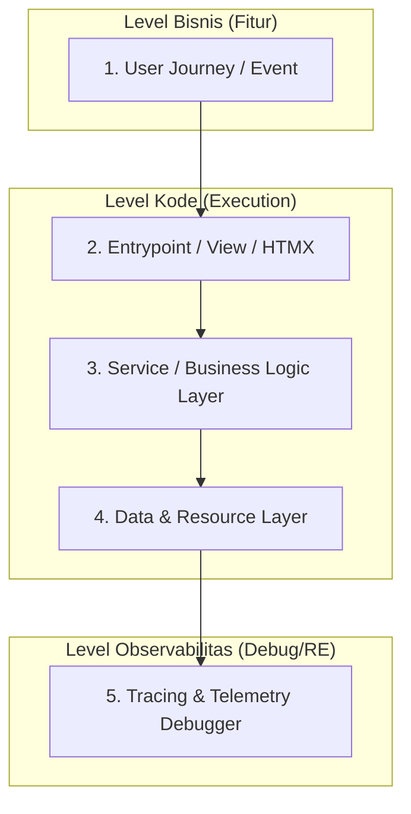
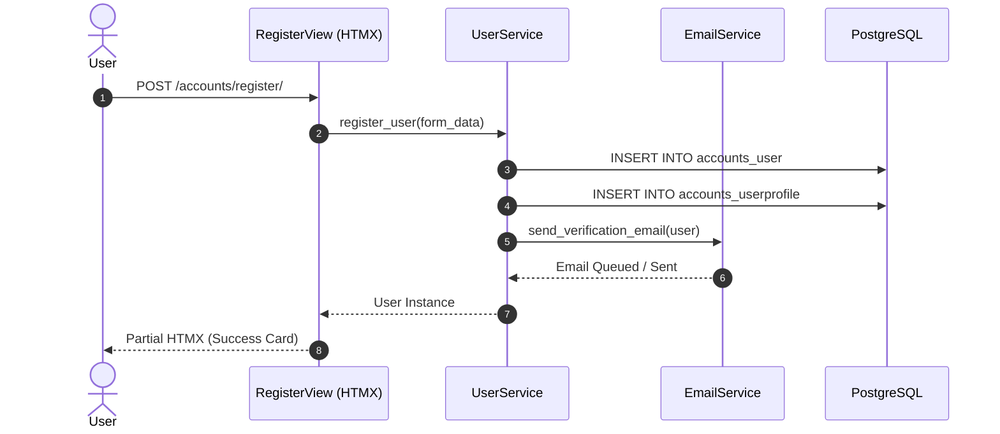
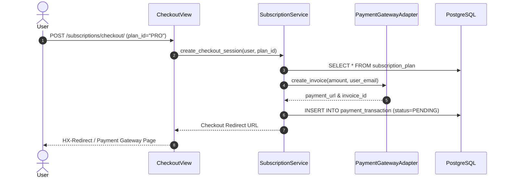
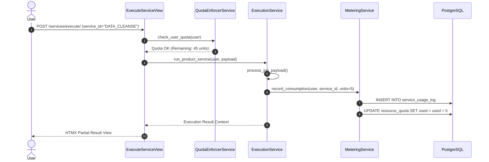

# Architecture Spec: Code Map & User Journey Tracing

Dokumen ini mendefinisikan arsitektur dan spesifikasi **Code Map & Debug Tracing Engine**. Sistem ini dirancang untuk melakukan *reverse engineering* alur eksekusi aplikasi, melacak aktivitas user dari tingkat bisnis (User Journey) hingga ke tingkat kode terkecil (*Class, Function, Database Query, Service Consumption*).

---

## 1. Konsep Utama Code Map

Code Map menghubungkan 5 lapisan (*layers*) eksekusi dalam aplikasi:



---

## 2. End-to-End User Journey Breakdown & Code Mapping

Berikut adalah pemetaan lengkap alur eksekusi (*Code Map*) dari 4 skenario utama aplikasi:

### Skenario 1: User Registration & Onboarding (Pembuatan Akun)

| Field | Detail |
|---|---|
| **Event Bisnis** | User membuat akun baru di sistem |
| **User Action** | Mengisi form registrasi → Submit tombol "Daftar" |
| **HTMX / Endpoint** | `POST /accounts/register/` (`apps.accounts.views.auth.RegisterView`) |
| **Service Layer** | `UserService.register_user(data)` (`apps.accounts.services.user_service.py`) |
| **Functions Called** | 1. `UserService._validate_registration()` <br> 2. `User.objects.create_user()` <br> 3. `EmailService.send_verification_email()` |
| **Models & DB** | `User`, `UserProfile`, `EmailVerificationToken` |
| **Debug Metric & Resource** | `db_queries: 4`, `execution_time_ms: 120ms`, `emails_sent: 1` |



---

### Skenario 2: Subscription & Payment Flow (Langganan & Pembayaran)

| Field | Detail |
|---|---|
| **Event Bisnis** | User memilih paket langganan dan melakukan pembayaran |
| **User Action** | Memilih Paket Pro → Klik "Bayar Sekarang" |
| **HTMX / Endpoint** | `POST /subscriptions/checkout/` (`apps.subscriptions.views.CheckoutView`) |
| **Service Layer** | `SubscriptionService.create_checkout_session(user, plan_id)` (`apps.subscriptions.services.subscription_service.py`) |
| **Functions Called** | 1. `PlanService.get_active_plan(plan_id)` <br> 2. `PaymentGatewayAdapter.create_invoice()` <br> 3. `SubscriptionService.activate_subscription()` (via Webhook) |
| **Models & DB** | `SubscriptionPlan`, `UserSubscription`, `PaymentTransaction`, `AuditLog` |
| **Debug Metric & Resource** | `external_api_calls: 1` (Payment Gateway), `db_queries: 6`, `execution_time_ms: 350ms` |



---

### Skenario 3: Product Execution & Service Consumption (Menjalankan Produk & Service)

| Field | Detail |
|---|---|
| **Event Bisnis** | User memilih produk/service (misal: AI Processing / Data Analysis) dan menjalankannya |
| **User Action** | Memilih Produk "Data Cleansing" → Klik "Jalankan Service" |
| **HTMX / Endpoint** | `POST /services/execute/` (`apps.services.views.ExecuteServiceView`) |
| **Service Layer** | `ProductExecutionService.execute_service(user, service_id, payload)` (`apps.services.services.execution_service.py`) |
| **Functions Called** | 1. `QuotaEnforcerService.check_user_quota(user)` <br> 2. `TaskWorker.dispatch_job(service_id, payload)` <br> 3. `MeteringService.record_consumption(user, units)` |
| **Models & DB** | `ProductService`, `ServiceUsageLog`, `ResourceQuota` |
| **Debug Metric & Resource** | `consumed_units: 5.0`, `cpu_time_sec: 1.4s`, `memory_mb: 256MB`, `db_queries: 5` |



---

### Skenario 4: Cost & Resource Metering Calculation (Kalkulasi Penggunaan Service)

| Field | Detail |
|---|---|
| **Event Bisnis** | Sistem menghitung akumulasi service & kuota yang dihabiskan user |
| **User Action** | Membuka Dashboard Usage / Admin Inspector |
| **HTMX / Endpoint** | `GET /dashboard/usage-metrics/` (`apps.dashboard.views.UsageMetricsView`) |
| **Service Layer** | `MeteringService.get_user_usage_breakdown(user, period)` |
| **Functions Called** | 1. `ServiceUsageLog.objects.filter(...)` <br> 2. `MeteringService.aggregate_by_service_type()` <br> 3. `CostCalculator.calculate_total_cost()` |
| **Models & DB** | `ServiceUsageLog`, `SubscriptionPlan` |
| **Debug Metric & Resource** | `aggregated_rows: 150`, `db_queries: 2`, `execution_time_ms: 25ms` |

---

## 3. Infrastruktur Kode Tracing & Reverse Engineering

Untuk memungkinkan reverse engineering dan penelusuran (*tracing*), kita mengimplementasikan 3 komponen kunci:

### A. Context Correlation Middleware (`TraceMiddleware`)
Setiap *HTTP Request* diberikan `trace_id` unik yang diteruskan ke semua lapisan (*Views*, *Services*, *DB Queries*).

```python
# apps/core/middleware/trace_middleware.py
import uuid
import threading

_trace_context = threading.local()

def get_current_trace_id():
    return getattr(_trace_context, "trace_id", None)

class TraceMiddleware:
    """
    Inject Correlation ID (trace_id) ke setiap request untuk kebutuhan reverse engineering & debug.
    US: US-014 — Logging & Telemetry Terstruktur
    """
    def __init__(self, get_response):
        self.get_response = get_response

    def __call__(self, request):
        trace_id = request.headers.get("X-Trace-ID", str(uuid.uuid4()))
        _trace_context.trace_id = trace_id
        request.trace_id = trace_id

        response = self.get_response(request)
        response["X-Trace-ID"] = trace_id
        return response
```

---

### B. Tracing Decorator untuk Service Layer (`@code_map_trace`)
Decorator ini otomatis mencatat *execution path*, waktu eksekusi, serta jumlah *DB query* dan kuota service yang dihabiskan.

```python
# apps/core/utils/tracing.py
import time
import functools
import logging
from django.db import connection
from apps.core.middleware.trace_middleware import get_current_trace_id

logger = logging.getLogger("code_map.tracer")

def code_map_trace(feature_name: str, service_unit_cost: float = 0.0):
    """
    Decorator untuk melacak eksekusi fungsi/class method dalam Code Map.
    """
    def decorator(func):
        @functools.wraps(func)
        def wrapper(*args, **kwargs):
            trace_id = get_current_trace_id() or "LOCAL_DEBUG"
            start_time = time.perf_counter()
            initial_queries = len(connection.queries)

            result = None
            exception_raised = None
            try:
                result = func(*args, **kwargs)
                return result
            except Exception as e:
                exception_raised = e
                raise
            finally:
                elapsed_ms = (time.perf_counter() - start_time) * 1000
                queries_count = len(connection.queries) - initial_queries
                
                module_name = func.__module__
                func_name = func.__qualname__

                logger.info(
                    f"[CODE_MAP_TRACE] | TraceID: {trace_id} | Feature: {feature_name} | "
                    f"Path: {module_name}.{func_name} | ExecutionTime: {elapsed_ms:.2f}ms | "
                    f"DBQueries: {queries_count} | ServiceUnits: {service_unit_cost} | "
                    f"Status: {'ERROR' if exception_raised else 'SUCCESS'}"
                )
        return wrapper
    return decorator
```

---

### C. Model Database Telemetry Trace (`ExecutionTraceLog`)

```python
# apps/core/models/trace_log.py
from django.db import models
from django.conf import settings

class ExecutionTraceLog(models.Model):
    """
    Menyimpan trace historis eksekusi user untuk kebutuhan Reverse Engineering & Debugging UI.
    """
    trace_id = models.CharField(max_length=64, db_index=True)
    user = models.ForeignKey(settings.AUTH_USER_MODEL, on_delete=models.CASCADE, null=True, blank=True)
    feature_name = models.CharField(max_length=100, db_index=True)
    endpoint = models.CharField(max_length=255)
    class_function_path = models.CharField(max_length=255)
    execution_time_ms = models.FloatField()
    db_query_count = models.IntegerField(default=0)
    service_units_consumed = models.FloatField(default=0.0)
    status_code = models.IntegerField(default=200)
    created_at = models.DateTimeField(auto_now_add=True)

    class Meta:
        ordering = ["-created_at"]
```

---

## 4. Format Output JSON Code Map (Untuk Debugger UI)

Sistem melahirkan output JSON hierarkis yang mudah dikonsumsi oleh UI Debugger / Reverse Engineering Tool:

```json
{
  "trace_id": "tr-984a12f5-83c9-4b10-a12b-31294abc01",
  "user_id": 42,
  "user_email": "dev@radian.web.id",
  "feature": "PRODUCT_EXECUTION",
  "user_story_ref": "US-036",
  "entrypoint": {
    "view_class": "ExecuteServiceView",
    "http_method": "POST",
    "url": "/services/execute/",
    "is_htmx": true
  },
  "execution_tree": [
    {
      "step": 1,
      "layer": "SERVICE",
      "class_method": "QuotaEnforcerService.check_user_quota",
      "file": "apps/services/services/quota_service.py:L24",
      "execution_time_ms": 12.4,
      "db_queries": 1,
      "status": "PASSED"
    },
    {
      "step": 2,
      "layer": "BUSINESS_LOGIC",
      "class_method": "ProductExecutionService.run_product_service",
      "file": "apps/services/services/execution_service.py:L45",
      "execution_time_ms": 145.8,
      "db_queries": 2,
      "status": "PASSED"
    },
    {
      "step": 3,
      "layer": "METERING",
      "class_method": "MeteringService.record_consumption",
      "file": "apps/services/services/metering_service.py:L18",
      "execution_time_ms": 8.2,
      "db_queries": 2,
      "service_units_consumed": 5.0,
      "status": "RECORDED"
    }
  ],
  "summary": {
    "total_time_ms": 166.4,
    "total_db_queries": 5,
    "total_service_units_consumed": 5.0,
    "status": "SUCCESS"
  }
}
```

---

## 5. Ringkasan Manfaat untuk Reverse Engineering & Debugging

1. **Complete Code Lineage**: Developer dapat melihat dari fitur mana sebuah fungsi dipanggil, siapa yang memanggilnya, dan baris kode (*file:line*) mana yang mengeksekusi query database.
2. **Resource Consumption Transparency**: Setiap event user (pendaftaran, checkout langganan, hingga eksekusi produk) dapat dihitung secara akurat berapa biaya/resource unit (*service units*) yang dikonsumsi.
3. **Penyelidikan Bug Instan**: Jika terjadi kegagalan (*error/exception*), `trace_id` akan langsung menunjukkan step mana di Service/Model layer yang mengalami kegagalan beserta snapshot konteks data-nya.
