# ERD & Database Architecture Specification

> Dokumen ini dibuat secara otomatis oleh management command `python manage.py generate_erd`.

## 📌 Ringkasan Skema

- **Total Aplikasi**: 5 (`accounts, core, dashboard, inventory, tenants`)
- **Total Model/Tabel**: 13

## 📐 Diagram ERD (Mermaid)

```mermaid
erDiagram
    Activity {
        bigint id PK "ID"
        bigint user_id FK "Pengguna"
        string title  "Judul Aktivitas"
        text description  "Deskripsi"
        string status  "Status"
        decimal amount  "Jumlah/Nilai"
        datetime created_at  "Dibuat Pada"
    }

    ExecutionTraceLog {
        bigint id PK "ID"
        string trace_id  "trace id"
        bigint user_id FK "user"
        string feature_name  "feature name"
        string endpoint  "endpoint"
        string class_function_path  "class function path"
        float execution_time_ms  "execution time ms"
        int db_query_count  "db query count"
        float service_units_consumed  "service units consumed"
        int status_code  "status code"
        datetime created_at  "created at"
    }

    HistoricalProduk {
        bigint id  "ID"
        string nama  "nama"
        string sku  "sku"
        decimal harga  "harga"
        int stok  "stok"
        text deskripsi  "deskripsi"
        string status  "status"
        datetime created_at  "created at"
        datetime updated_at  "updated at"
        bigint kategori_id FK "kategori"
        bigint pemasok_id FK "pemasok"
        bigint history_id PK "history id"
        datetime history_date  "history date"
        string history_change_reason  "history change reason"
        string history_type  "history type"
        bigint history_user_id FK "history user"
    }

    HistoricalUser {
        bigint id  "ID"
        string password
        datetime last_login
        bool is_superuser
        string username
        string first_name
        string last_name
        bool is_staff
        bool is_active
        datetime date_joined
        string email
        bool email_verified
        datetime email_verified_at
        datetime created_at
        datetime updated_at
        bigint history_id PK "history id"
        datetime history_date  "history date"
        string history_change_reason  "history change reason"
        string history_type  "history type"
        bigint history_user_id FK "history user"
    }

    Kategori {
        bigint id PK "ID"
        string nama  "nama"
    }

    Organization {
        bigint id PK "ID"
        string name  "Nama Organisasi"
        slugfield slug  "Subdomain / Identifier"
        bigint owner_id FK "Pemilik"
        string logo  "Logo Organisasi"
        bool is_active  "Status Aktif"
        datetime created_at  "Dibuat Pada"
        datetime updated_at  "Diperbarui Pada"
    }

    OrganizationMember {
        bigint id PK "ID"
        bigint organization_id FK "Organisasi"
        bigint user_id FK "Pengguna"
        string role  "Peran"
        datetime joined_at  "Tanggal Bergabung"
    }

    PasskeyCredential {
        bigint id PK "ID"
        bigint user_id FK
        string name
        string credential_id
        text public_key
        int sign_count
        datetime created_at
        datetime last_used_at
    }

    Pemasok {
        bigint id PK "ID"
        string nama  "nama"
    }

    Produk {
        bigint id PK "ID"
        string nama  "nama"
        string sku  "sku"
        bigint kategori_id FK "kategori"
        decimal harga  "harga"
        int stok  "stok"
        bigint pemasok_id FK "pemasok"
        text deskripsi  "deskripsi"
        string status  "status"
        datetime created_at  "created at"
        datetime updated_at  "updated at"
    }

    SystemUpdate {
        bigint id PK "ID"
        string version  "version"
        string title  "title"
        text description  "description"
        string update_type  "update type"
        datetime release_date  "release date"
    }

    User {
        bigint id PK "ID"
        string password
        datetime last_login
        bool is_superuser
        string username
        string first_name
        string last_name
        bool is_staff
        bool is_active
        datetime date_joined
        string email
        bool email_verified
        datetime email_verified_at
        datetime created_at
        datetime updated_at
    }

    UserProfile {
        bigint user_id PK
        string avatar
        text bio
        json extra_data
        datetime created_at
        datetime updated_at
    }

    User ||--o{ ExecutionTraceLog : "user"
    User ||--o{ PasskeyCredential : "user"
    User ||--o{ HistoricalUser : "history_user"
    User ||--|| UserProfile : "user"
    User ||--o{ Activity : "user"
    Kategori ||--o{ HistoricalProduk : "kategori"
    Pemasok ||--o{ HistoricalProduk : "pemasok"
    User ||--o{ HistoricalProduk : "history_user"
    Kategori ||--o{ Produk : "kategori"
    Pemasok ||--o{ Produk : "pemasok"
    User ||--o{ Organization : "owner"
    Organization ||--o{ OrganizationMember : "organization"
    User ||--o{ OrganizationMember : "user"
```

## 🗂️ Rincian Tabel Database

### Domain App: `accounts`

#### Model: `HistoricalUser` (`accounts_historicaluser`)

| Kolom / Field | Tipe Data | Key | Nullable | Default | Deskripsi / Help Text |
|---|---|---|---|---|---|
| `id` | `BigIntegerField` | - | Tidak | - | ID |
| `password` | `CharField` | - | Tidak | - | sandi |
| `last_login` | `DateTimeField` | - | Ya | - | masuk terakhir |
| `is_superuser` | `BooleanField` | - | Tidak | `False` | Menentukan apakah pengguna memiliki semua hak akses tanpa perlu diberikan secara manual. |
| `username` | `CharField` | - | Tidak | - | Wajib. 150 karakter atau sedikit. Hanya huruf, angka, dan @/./+/-/_. |
| `first_name` | `CharField` | - | Tidak | - | nama depan |
| `last_name` | `CharField` | - | Tidak | - | nama belakang |
| `is_staff` | `BooleanField` | - | Tidak | `False` | Menentukan apakah pengguna berhak masuk ke situs administrasi ini. |
| `is_active` | `BooleanField` | - | Tidak | `True` | Menentukan apakah pengguna dianggap aktif. Hapus pilihan ini tanpa perlu menghapus akunnya. |
| `date_joined` | `DateTimeField` | - | Tidak | `now` | tanggal bergabung |
| `email` | `CharField` | - | Tidak | - | Unique email address untuk login |
| `email_verified` | `BooleanField` | - | Tidak | `False` | Email sudah diverifikasi via link |
| `email_verified_at` | `DateTimeField` | - | Ya | - | Timestamp saat email diverifikasi |
| `created_at` | `DateTimeField` | - | Tidak | - | created at |
| `updated_at` | `DateTimeField` | - | Tidak | - | updated at |
| `history_id` | `AutoField` | **PK** | Tidak | - | history id |
| `history_date` | `DateTimeField` | - | Tidak | - | history date |
| `history_change_reason` | `CharField` | - | Ya | - | history change reason |
| `history_type` | `CharField` | - | Tidak | - | history type |
| `history_user_id` | `ForeignKey` | **FK** | Ya | - | history user (Relasi ke `User`) |

#### Model: `PasskeyCredential` (`accounts_passkeycredential`)
_Menyimpan public key dan metadata perangkat (sidik jari/kamera) untuk login WebAuthn._

| Kolom / Field | Tipe Data | Key | Nullable | Default | Deskripsi / Help Text |
|---|---|---|---|---|---|
| `id` | `BigAutoField` | **PK** | Tidak | - | ID |
| `user_id` | `ForeignKey` | **FK** | Tidak | - | pengguna (Relasi ke `User`) |
| `name` | `CharField` | - | Tidak | `Passkey Device` | Nama perangkat untuk identifikasi user |
| `credential_id` | `CharField` | - | Tidak | - | credential ID |
| `public_key` | `TextField` | - | Tidak | - | public key |
| `sign_count` | `PositiveIntegerField` | - | Tidak | `0` | sign count |
| `created_at` | `DateTimeField` | - | Tidak | - | created at |
| `last_used_at` | `DateTimeField` | - | Ya | - | last used at |

#### Model: `User` (`accounts_user`)
_TUJUAN: Custom User model untuk RDP dengan email verification dan timestamps._

| Kolom / Field | Tipe Data | Key | Nullable | Default | Deskripsi / Help Text |
|---|---|---|---|---|---|
| `id` | `BigAutoField` | **PK** | Tidak | - | ID |
| `password` | `CharField` | - | Tidak | - | sandi |
| `last_login` | `DateTimeField` | - | Ya | - | masuk terakhir |
| `is_superuser` | `BooleanField` | - | Tidak | `False` | Menentukan apakah pengguna memiliki semua hak akses tanpa perlu diberikan secara manual. |
| `username` | `CharField` | - | Tidak | - | Wajib. 150 karakter atau sedikit. Hanya huruf, angka, dan @/./+/-/_. |
| `first_name` | `CharField` | - | Tidak | - | nama depan |
| `last_name` | `CharField` | - | Tidak | - | nama belakang |
| `is_staff` | `BooleanField` | - | Tidak | `False` | Menentukan apakah pengguna berhak masuk ke situs administrasi ini. |
| `is_active` | `BooleanField` | - | Tidak | `True` | Menentukan apakah pengguna dianggap aktif. Hapus pilihan ini tanpa perlu menghapus akunnya. |
| `date_joined` | `DateTimeField` | - | Tidak | `now` | tanggal bergabung |
| `email` | `CharField` | - | Tidak | - | Unique email address untuk login |
| `email_verified` | `BooleanField` | - | Tidak | `False` | Email sudah diverifikasi via link |
| `email_verified_at` | `DateTimeField` | - | Ya | - | Timestamp saat email diverifikasi |
| `created_at` | `DateTimeField` | - | Tidak | - | created at |
| `updated_at` | `DateTimeField` | - | Tidak | - | updated at |
| `groups` | `ManyToManyField` | **M2M** | Ya | - | Relasi Many-to-Many ke `Group` |
| `user_permissions` | `ManyToManyField` | **M2M** | Ya | - | Relasi Many-to-Many ke `Permission` |

#### Model: `UserProfile` (`accounts_userprofile`)
_TUJUAN: Extended profile information untuk setiap User._

| Kolom / Field | Tipe Data | Key | Nullable | Default | Deskripsi / Help Text |
|---|---|---|---|---|---|
| `user_id` | `OneToOneField` | **PK** | Tidak | - | pengguna (Relasi ke `User`) |
| `avatar` | `FileField` | - | Ya | - | Foto profil user (max 2MB, JPG/PNG) |
| `bio` | `TextField` | - | Tidak | - | Deskripsi singkat tentang user |
| `extra_data` | `JSONField` | - | Tidak | `dict` | Data tambahan dari registration wizard (konfigurasi via REGISTRATION_STEPS) |
| `created_at` | `DateTimeField` | - | Tidak | - | created at |
| `updated_at` | `DateTimeField` | - | Tidak | - | updated at |

### Domain App: `core`

#### Model: `ExecutionTraceLog` (`core_executiontracelog`)
_Menyimpan trace historis eksekusi user untuk kebutuhan Reverse Engineering & Debugging._

| Kolom / Field | Tipe Data | Key | Nullable | Default | Deskripsi / Help Text |
|---|---|---|---|---|---|
| `id` | `BigAutoField` | **PK** | Tidak | - | ID |
| `trace_id` | `CharField` | - | Tidak | - | trace id |
| `user_id` | `ForeignKey` | **FK** | Ya | - | user (Relasi ke `User`) |
| `feature_name` | `CharField` | - | Tidak | - | feature name |
| `endpoint` | `CharField` | - | Tidak | `` | endpoint |
| `class_function_path` | `CharField` | - | Tidak | - | class function path |
| `execution_time_ms` | `FloatField` | - | Tidak | `0.0` | execution time ms |
| `db_query_count` | `IntegerField` | - | Tidak | `0` | db query count |
| `service_units_consumed` | `FloatField` | - | Tidak | `0.0` | service units consumed |
| `status_code` | `IntegerField` | - | Tidak | `200` | status code |
| `created_at` | `DateTimeField` | - | Tidak | - | created at |

### Domain App: `dashboard`

#### Model: `Activity` (`dashboard_activity`)
_Model Activity untuk mencatat aktivitas / transaksi dummy di dashboard._

| Kolom / Field | Tipe Data | Key | Nullable | Default | Deskripsi / Help Text |
|---|---|---|---|---|---|
| `id` | `BigAutoField` | **PK** | Tidak | - | ID |
| `user_id` | `ForeignKey` | **FK** | Tidak | - | Pengguna (Relasi ke `User`) |
| `title` | `CharField` | - | Tidak | - | Judul Aktivitas |
| `description` | `TextField` | - | Tidak | - | Deskripsi |
| `status` | `CharField` | - | Tidak | `pending` | Status |
| `amount` | `DecimalField` | - | Tidak | `0.0` | Jumlah/Nilai |
| `created_at` | `DateTimeField` | - | Tidak | - | Dibuat Pada |

#### Model: `SystemUpdate` (`dashboard_systemupdate`)
_Model untuk menyimpan log pembaruan sistem (Changelog / Deploy Log)._

| Kolom / Field | Tipe Data | Key | Nullable | Default | Deskripsi / Help Text |
|---|---|---|---|---|---|
| `id` | `BigAutoField` | **PK** | Tidak | - | ID |
| `version` | `CharField` | - | Tidak | - | Contoh: v1.1.0 |
| `title` | `CharField` | - | Tidak | - | title |
| `description` | `TextField` | - | Tidak | - | description |
| `update_type` | `CharField` | - | Tidak | `feature` | update type |
| `release_date` | `DateTimeField` | - | Tidak | - | release date |

### Domain App: `inventory`

#### Model: `HistoricalProduk` (`inventory_historicalproduk`)

| Kolom / Field | Tipe Data | Key | Nullable | Default | Deskripsi / Help Text |
|---|---|---|---|---|---|
| `id` | `BigIntegerField` | - | Tidak | - | ID |
| `nama` | `CharField` | - | Tidak | - | nama |
| `sku` | `CharField` | - | Ya | - | sku |
| `harga` | `DecimalField` | - | Tidak | `0` | harga |
| `stok` | `IntegerField` | - | Tidak | `0` | stok |
| `deskripsi` | `TextField` | - | Tidak | - | deskripsi |
| `status` | `CharField` | - | Tidak | `aktif` | status |
| `created_at` | `DateTimeField` | - | Tidak | `now` | created at |
| `updated_at` | `DateTimeField` | - | Tidak | - | updated at |
| `kategori_id` | `ForeignKey` | **FK** | Ya | - | kategori (Relasi ke `Kategori`) |
| `pemasok_id` | `ForeignKey` | **FK** | Ya | - | pemasok (Relasi ke `Pemasok`) |
| `history_id` | `AutoField` | **PK** | Tidak | - | history id |
| `history_date` | `DateTimeField` | - | Tidak | - | history date |
| `history_change_reason` | `CharField` | - | Ya | - | history change reason |
| `history_type` | `CharField` | - | Tidak | - | history type |
| `history_user_id` | `ForeignKey` | **FK** | Ya | - | history user (Relasi ke `User`) |

#### Model: `Kategori` (`inventory_kategori`)
_TUJUAN: Kategori produk untuk filter dan grouping._

| Kolom / Field | Tipe Data | Key | Nullable | Default | Deskripsi / Help Text |
|---|---|---|---|---|---|
| `id` | `BigAutoField` | **PK** | Tidak | - | ID |
| `nama` | `CharField` | - | Tidak | - | nama |

#### Model: `Pemasok` (`inventory_pemasok`)
_TUJUAN: Data pemasok/supplier produk._

| Kolom / Field | Tipe Data | Key | Nullable | Default | Deskripsi / Help Text |
|---|---|---|---|---|---|
| `id` | `BigAutoField` | **PK** | Tidak | - | ID |
| `nama` | `CharField` | - | Tidak | - | nama |

#### Model: `Produk` (`inventory_produk`)
_TUJUAN: Model produk utama — demo CRUD dashboard._

| Kolom / Field | Tipe Data | Key | Nullable | Default | Deskripsi / Help Text |
|---|---|---|---|---|---|
| `id` | `BigAutoField` | **PK** | Tidak | - | ID |
| `nama` | `CharField` | - | Tidak | - | nama |
| `sku` | `CharField` | - | Ya | - | sku |
| `kategori_id` | `ForeignKey` | **FK** | Ya | - | kategori (Relasi ke `Kategori`) |
| `harga` | `DecimalField` | - | Tidak | `0` | harga |
| `stok` | `IntegerField` | - | Tidak | `0` | stok |
| `pemasok_id` | `ForeignKey` | **FK** | Ya | - | pemasok (Relasi ke `Pemasok`) |
| `deskripsi` | `TextField` | - | Tidak | - | deskripsi |
| `status` | `CharField` | - | Tidak | `aktif` | status |
| `created_at` | `DateTimeField` | - | Tidak | `now` | created at |
| `updated_at` | `DateTimeField` | - | Tidak | - | updated at |

### Domain App: `tenants`

#### Model: `Organization` (`tenants_organization`)
_Model Organisasi / Tenant utama._

| Kolom / Field | Tipe Data | Key | Nullable | Default | Deskripsi / Help Text |
|---|---|---|---|---|---|
| `id` | `BigAutoField` | **PK** | Tidak | - | ID |
| `name` | `CharField` | - | Tidak | - | Nama Organisasi |
| `slug` | `SlugField` | - | Tidak | - | Subdomain / Identifier |
| `owner_id` | `ForeignKey` | **FK** | Tidak | - | Pemilik (Relasi ke `User`) |
| `logo` | `FileField` | - | Ya | - | Logo Organisasi |
| `is_active` | `BooleanField` | - | Tidak | `True` | Status Aktif |
| `created_at` | `DateTimeField` | - | Tidak | - | Dibuat Pada |
| `updated_at` | `DateTimeField` | - | Tidak | - | Diperbarui Pada |

#### Model: `OrganizationMember` (`tenants_organizationmember`)
_Relasi keanggotaan User dalam Organization._

| Kolom / Field | Tipe Data | Key | Nullable | Default | Deskripsi / Help Text |
|---|---|---|---|---|---|
| `id` | `BigAutoField` | **PK** | Tidak | - | ID |
| `organization_id` | `ForeignKey` | **FK** | Tidak | - | Organisasi (Relasi ke `Organization`) |
| `user_id` | `ForeignKey` | **FK** | Tidak | - | Pengguna (Relasi ke `User`) |
| `role` | `CharField` | - | Tidak | `member` | Peran |
| `joined_at` | `DateTimeField` | - | Tidak | - | Tanggal Bergabung |

## 🔗 Daftar Relasi Antar Tabel

| Model Asal | Tipe Relasi | Model Target | Nama Field |
|---|---|---|---|
| `ExecutionTraceLog` | Foreign Key (`||--o{`) | `User` | `user` |
| `PasskeyCredential` | Foreign Key (`||--o{`) | `User` | `user` |
| `HistoricalUser` | Foreign Key (`||--o{`) | `User` | `history_user` |
| `UserProfile` | One-to-One (`||--||`) | `User` | `user` |
| `Activity` | Foreign Key (`||--o{`) | `User` | `user` |
| `HistoricalProduk` | Foreign Key (`||--o{`) | `Kategori` | `kategori` |
| `HistoricalProduk` | Foreign Key (`||--o{`) | `Pemasok` | `pemasok` |
| `HistoricalProduk` | Foreign Key (`||--o{`) | `User` | `history_user` |
| `Produk` | Foreign Key (`||--o{`) | `Kategori` | `kategori` |
| `Produk` | Foreign Key (`||--o{`) | `Pemasok` | `pemasok` |
| `Organization` | Foreign Key (`||--o{`) | `User` | `owner` |
| `OrganizationMember` | Foreign Key (`||--o{`) | `Organization` | `organization` |
| `OrganizationMember` | Foreign Key (`||--o{`) | `User` | `user` |
