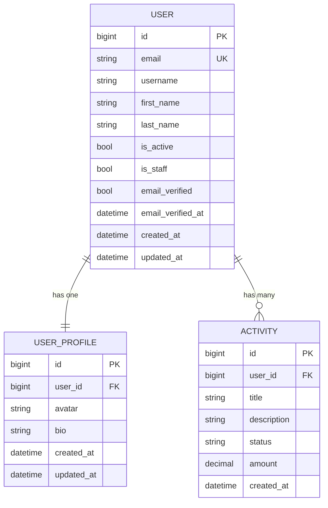

# ERD — RDP Starter Kit

> Wajib diupdate setiap kali file di `models/` berubah (tambah model, tambah field, ubah relasi).

## Diagram

## Catatan

- `USER.email` digunakan sebagai `USERNAME_FIELD` (login dengan email)
- `USER_PROFILE` dibuat otomatis via signal saat `USER` baru dibuat
