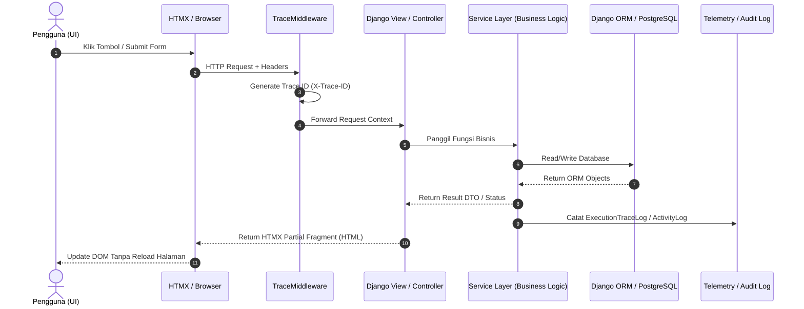

# StarterKit Master Code Map & Status Index

Dokumen ini merupakan **Pusat Navigasi & Code Map (Tracing Matrix)** untuk seluruh sistem **RDP StarterKit**. 

Code Map ini memetakan alur kerja aplikasi dari **User Event / UI Level** hingga ke **Route/View**, **Service Layer**, **Data Model**, dan **Telemetry Log**, serta melacak status pekerjaan (**Selesai `[x]`**, **Sebagian `[-]`**, dan **Akan Dikerjakan `[ ]`**).

---

## 📌 Indeks Modul Code Map StarterKit

| Modul / Domain | Deskripsi & Cakupan | User Story Ref | Link Dokumen Code Map |
|---|---|---|---|
| 🔑 **Authentication & Account** | Register, Login, Email Verification, Passkeys (WebAuthn), Password Reset, Profile, Bulk Upload | `US-004` s/d `US-009`, `US-018`, `US-025` | [auth-and-account.md](auth-and-account.md) |
| 📊 **Dashboard & RBAC** | Dashboard Analytics, User Management, Granular Permissions (RBAC), Activity Log, Changelog | `US-010` s/d `US-013`, `US-028` | [dashboard-and-rbac.md](dashboard-and-rbac.md) |
| 🎨 **UI Architecture & Components** | PicoCSS, RDP-UI CDN, Cotton Components (`<c-rdp.*>`), HTMX Partial Patterns, Modals | `US-014` s/d `US-017` | [ui-and-components.md](ui-and-components.md) |
| 🛠️ **Core Infrastructure & CLI** | Code Map Telemetry (`ExecutionTraceLog`), CLI `rdp` Generators, Scaffolding, DB Management | `US-024`, `US-030`, `US-031` | [core-telemetry-and-cli.md](core-telemetry-and-cli.md) |
| 📋 **Status Matrix & Roadmap** | Ringkasan Status 42 User Stories (`[x]`, `[-]`, `[ ]`) & Roadmap Pengerjaan Berikutnya | `US-001` s/d `US-042` | [roadmap-status-matrix.md](roadmap-status-matrix.md) |

---

## 📐 Arsitektur Tracing Telemetri (Code Map Pipeline)

Setiap aksi pengguna yang terdokumentasi dalam Code Map melewati pipeline eksekusi terpadu:

---

## 🚀 Ringkasan Status Global StarterKit

* **Fitur Selesai `[x]`**: 32 / 42 User Stories (80% Production Ready)
* **Fitur Sebagian `[-]`**: 6 / 42 User Stories (14% Enhancement Candidate)
* **Fitur Belum `[ ]`**: 4 / 42 User Stories (6% Future Milestone v0.3)

Untuk melihat rincian tabel status dan rencana kerja berikutnya, silakan buka **[roadmap-status-matrix.md](roadmap-status-matrix.md)**.
