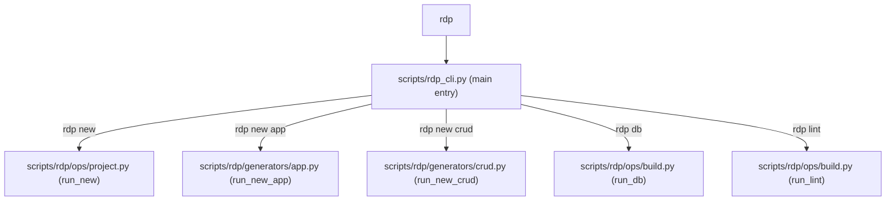

# Code Map & Tracing Matrix: Core Telemetry & CLI Tooling

Dokumen ini mendokumentasikan pemetaan kode lengkap (*Code Map*) untuk infrastruktur inti **Core Telemetry (Trace Logging)**, **CLI Tooling `rdp`**, dan **Management Commands**.

---

## 1. Tracing Matrix: Infrastructure & Developer Tooling

### A. Execution Telemetry & Request Tracing (`US-030`) — Status: `[x] Selesai`

| Step | System Event | Source File | Function / Class | Output Artifact / DB | Status |
|---|---|---|---|---|---|
| 1 | Intersept Request Header | [apps/core/middleware.py](file:///c:/Users/rahad/Work/org/rdp/starterkit/apps/core/middleware.py) | [TraceMiddleware](file:///c:/Users/rahad/Work/org/rdp/starterkit/apps/core/middleware.py#L15) | Injeksikan `X-Trace-ID` di Request & Response | `[x]` |
| 2 | Telemetry Context Storage | [apps/core/utils/tracing.py](file:///c:/Users/rahad/Work/org/rdp/starterkit/apps/core/utils/tracing.py) | `set_current_trace_id` / `get_current_trace_id` | Thread-local storage context | `[x]` |
| 3 | Code Execution Decorator | [apps/core/utils/tracing.py](file:///c:/Users/rahad/Work/org/rdp/starterkit/apps/core/utils/tracing.py#L30) | `@code_map_trace(feature_name="...")` | Record execution time (ms) | `[x]` |
| 4 | Database Persistence | [apps/core/models/trace_log.py](file:///c:/Users/rahad/Work/org/rdp/starterkit/apps/core/models/trace_log.py) | `ExecutionTraceLog` | Simpan trace ke tabel database DB | `[x]` |

---

### B. CLI Command Suite `rdp` (`US-024`) — Status: `[x] Selesai`



| Sub-command | Executable Script | Target Action | Status |
|---|---|---|---|
| `rdp new <name>` | [scripts/rdp/ops/project.py](file:///c:/Users/rahad/Work/org/rdp/starterkit/scripts/rdp/ops/project.py) | Bootstrap proyek baru lengkap dengan `uv sync` & `.env` | `[x]` |
| `rdp new app <name>` | [scripts/rdp/generators/app.py](file:///c:/Users/rahad/Work/org/rdp/starterkit/scripts/rdp/generators/app.py) | Generate app Django baru berpola *package per fungsi* | `[x]` |
| `rdp new crud <model>` | [scripts/rdp/generators/crud.py](file:///c:/Users/rahad/Work/org/rdp/starterkit/scripts/rdp/generators/crud.py) | Generate Views + Forms + Templates + URLs + Code Map | `[x]` |
| `rdp db migrate/reset` | [scripts/rdp/ops/build.py](file:///c:/Users/rahad/Work/org/rdp/starterkit/scripts/rdp/ops/build.py) | Kelola database SQLite / PostgreSQL | `[x]` |
| `rdp lint` | [scripts/rdp/ops/build.py](file:///c:/Users/rahad/Work/org/rdp/starterkit/scripts/rdp/ops/build.py) | Jalankan `ruff check` dan linter template | `[x]` |

---

### C. Management Commands (`US-031`) — Status: `[x] Selesai`

| Command Name | File Path | Function / Purpose | Status |
|---|---|---|---|
| `python manage.py make_crud_codemap` | [apps/core/management/commands/make_crud_codemap.py](file:///c:/Users/rahad/Work/org/rdp/starterkit/apps/core/management/commands/make_crud_codemap.py) | Generate Code Map & Docs otomatis untuk Model CRUD | `[x]` |
| `python manage.py loaddemodata` | [apps/core/management/commands/loaddemodata.py](file:///c:/Users/rahad/Work/org/rdp/starterkit/apps/core/management/commands/loaddemodata.py) | Inject data awal/dummy untuk pengujian aplikasi | `[x]` |
| `python manage.py app_version` | [apps/core/management/commands/app_version.py](file:///c:/Users/rahad/Work/org/rdp/starterkit/apps/core/management/commands/app_version.py) | Menampilkan versi aplikasi aktif dari CHANGELOG | `[x]` |

---

## 2. Struktur Komponen Core App Codebase

```text
apps/core/
├── context_processors.py      ← Dynamic Context Injection (App Version, App Name)
├── decorators/                ← Custom Decorators (Auth, Permissions)
├── management/                ← Custom Django Management Commands
│   └── commands/
│       ├── app_version.py
│       ├── loaddemodata.py
│       └── make_crud_codemap.py
├── middleware.py              ← TraceMiddleware (Generation X-Trace-ID)
├── mixins/                    ← View Mixins (HtmxResponseMixin, MultiplePermissionsRequiredMixin)
├── models/
│   └── trace_log.py           ← ExecutionTraceLog Data Model
├── templatetags/              ← Custom Django Template Tags (auth_tags.py)
└── utils/
    ├── htmx.py                ← HTMX Helper Utilities (htmx_redirect, htmx_trigger)
    ├── tracing.py             ← Telemetry Decorator (@code_map_trace)
    └── turnstile.py           ← Cloudflare Turnstile Verification Helper
```
