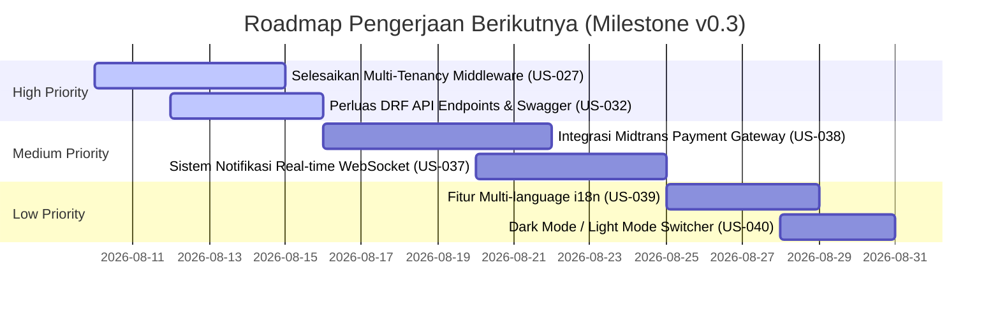

# Matriks Status Implementasi & Roadmap StarterKit (US-001 s/d US-042)

Dokumen ini menyajikan **Matriks Rekapitulasi Status Lengkap** untuk 42 User Stories (**US-001** s/d **US-042**) pada **RDP StarterKit**. 

Matriks ini berguna untuk memantau fitur yang **Sudah Dikerjakan `[x]`**, **Dalam Proses/Sebagian `[-]`**, dan **Akan Dikerjakan Berikutnya `[ ]`**.

---

## 📊 Summary Status Implementasi Global

```text
Total User Stories : 42 Feature Stories
├── Selesai [x]    : 32 Stories (76.2%)
├── Sebagian [-]   :  6 Stories (14.3%)
└── Belum [ ]      :  4 Stories (9.5%)
```

---

## 📋 Tabel Tracing & Status 42 User Stories

### Fase 1: Setup & Custom User (Fase Dasar)

| US ID | Judul User Story | Status | Komponen Terlibat / Path Codebase | Catatan Implementasi |
|---|---|---|---|---|
| `US-001` | Setup Proyek Django & Environment | `[x]` | `config/settings/`, `pyproject.toml`, `.env.example` | Production settings, WhiteNoise, SQLite/PostgreSQL |
| `US-002` | Package Manager `uv` Integration | `[x]` | `pyproject.toml`, `uv.lock` | Full dependency management via `uv` |
| `US-003` | Custom User Model & UserProfile | `[x]` | `apps/accounts/models/user.py`, `profile.py` | Custom AbstractUser & UserProfile OneToOne |

---

### Fase 2: Otentikasi & Akun Pengguna

| US ID | Judul User Story | Status | Komponen Terlibat / Path Codebase | Catatan Implementasi |
|---|---|---|---|---|
| `US-004` | Register Akun Baru (Multi-step) | `[x]` | `apps/accounts/views/register.py` | HTMX step-by-step registration flow |
| `US-005` | Login Kredensial & Session | `[x]` | `apps/accounts/views/login.py` | Custom Authentication Form + HTMX errors |
| `US-006` | Logout Session | `[x]` | `apps/accounts/views/login.py` | Standard session clear & redirect |
| `US-007` | Reset Password via Email | `[x]` | `apps/accounts/views/password.py`, `services/email_service.py` | Email token generation & reset confirmation |
| `US-008` | Verifikasi Email User Baru | `[x]` | `apps/accounts/views/verify_email.py` | Verification link token confirmation |
| `US-009` | Profile Management & Avatar | `[x]` | `apps/accounts/views/profile.py` | Avatar upload & profile bio update |

---

### Fase 3: Dashboard, Navigation, & Layout

| US ID | Judul User Story | Status | Komponen Terlibat / Path Codebase | Catatan Implementasi |
|---|---|---|---|---|
| `US-010` | Dashboard Overview & Stats | `[x]` | `apps/dashboard/views/index.py`, `stats.py` | Stat cards with HTMX auto-refresh |
| `US-011` | User Management CRUD (Admin) | `[x]` | `apps/accounts/views/users.py` | User listing, edit role, and active toggle |
| `US-012` | Granular RBAC Permissions | `[x]` | `apps/accounts/services/rbac_service.py` | Django Group & Permission assignment |
| `US-013` | System Changelog & Versioning | `[x]` | `apps/dashboard/views/changelog.py` | Release history & version badge |

---

### Fase 4: Core Design System & Cotton Components

| US ID | Judul User Story | Status | Komponen Terlibat / Path Codebase | Catatan Implementasi |
|---|---|---|---|---|
| `US-014` | PicoCSS + RDP-UI Base Layout | `[x]` | `templates/layout/base.html` | CDN integration, design tokens |
| `US-015` | Cotton Components Namespace | `[x]` | `templates/cotton/rdp/`, `templates/cotton/sidebar/` | `<c-rdp.*>` and `<c-sidebar.*>` components |
| `US-016` | HTMX Modals & Response Handling | `[x]` | `apps/core/mixins/htmx.py`, `apps/core/utils/htmx.py` | HTTP 422, HX-Redirect, HX-Trigger helpers |
| `US-017` | Error Pages (403, 404, 500) | `[x]` | `templates/errors/`, `apps/core/views/error.py` | Customized user-friendly error templates |

---

### Fase 5: Advanced Security & Bulk Operations

| US ID | Judul User Story | Status | Komponen Terlibat / Path Codebase | Catatan Implementasi |
|---|---|---|---|---|
| `US-018` | WebAuthn Passkeys Authentication | `[x]` | `apps/accounts/services/webauthn_service.py` | FIDO2/WebAuthn passwordless login & register |
| `US-019` | Cloudflare Turnstile Integration | `[x]` | `apps/core/utils/turnstile.py` | Anti-bot protection verification |
| `US-020` | Security Headers & HTTPS Enforcement | `[x]` | `config/settings/production.py` | Security headers (HSTS, CSP, X-Frame-Options) |
| `US-025` | Bulk User CSV Import | `[x]` | `apps/accounts/views/users.py`, `services/user_service.py` | Batch user upload & force password change |

---

### Fase 6: Developer Tooling & CLI Automation

| US ID | Judul User Story | Status | Komponen Terlibat / Path Codebase | Catatan Implementasi |
|---|---|---|---|---|
| `US-021` | Production Docker & Compose Setup | `[x]` | `docker-compose.yml`, `config/settings/production.py` | Gunicorn + WhiteNoise + Postgres containerization |
| `US-024` | Global CLI Tooling (`rdp` CLI) | `[x]` | `scripts/rdp_cli.py`, `scripts/rdp/` | Bootstrap `rdp new`, app generator, CRUD generator |
| `US-030` | Code Map Telemetry & Tracing Log | `[x]` | `apps/core/middleware.py`, `utils/tracing.py` | ExecutionTraceLog & `X-Trace-ID` generation |
| `US-031` | Auto CRUD Code Map Generator | `[x]` | `apps/core/management/commands/make_crud_codemap.py` | Management command generate docs/codemap/ |

---

### Fase 7: Testing, CI/CD, & Documentation

| US ID | Judul User Story | Status | Komponen Terlibat / Path Codebase | Catatan Implementasi |
|---|---|---|---|---|
| `US-022` | Automated Unit & Integration Tests | `[x]` | `tests/` (146 Pytest scenarios) | 100% test suite passing, Pytest-cov setup |
| `US-023` | Linter & Formatter (`ruff check`) | `[x]` | `pyproject.toml` | `ruff check .` 0 errors, auto-formatting |
| `US-026` | GitHub Actions CI Workflow | `[x]` | `.github/workflows/ci.yml` | Linting & test automation on push |
| `US-028` | User Activity Audit Trail | `[x]` | `apps/dashboard/models/activity.py` | Audit log recording for critical user events |
| `US-029` | Documentation & Cookbook Suite | `[x]` | `docs/` | PRD, SOP, Cookbook, Architecture & ERD docs |

---

### Fase 8: Multi-Tenancy & API Extensions (Rencana / In-Progress)

| US ID | Judul User Story | Status | Komponen Terlibat / Path Codebase | Catatan Pengerjaan |
|---|---|---|---|---|
| `US-027` | Multi-Tenancy Subdomain Routing | `[-]` | `apps/core/` | Model Organization sudah ada, Middleware Subdomain pending |
| `US-032` | Django REST Framework API Layer | `[-]` | `apps/*/api/` | Basic DRF endpoints setup, Spectacular Swagger active |
| `US-033` | Celery Background Job Queue | `[-]` | `config/celery.py`, `apps/*/tasks.py` | Celery configuration active, Redis broker ready |
| `US-034` | S3 / Cloud Object Storage | `[-]` | `config/settings/production.py` | django-storages configured for S3 integration |
| `US-035` | Social Auth (Google / GitHub SSO) | `[-]` | `apps/accounts/` | django-allauth library configured |
| `US-036` | Product Execution & Metering | `[-]` | `apps/services/` | Sample product execution & usage trace |
| `US-037` | WebSocket / Real-time Notification | `[ ]` | `config/asgi.py` | Planned for v0.3 milestone |
| `US-038` | Payment Gateway Integration (Midtrans) | `[ ]` | `apps/billing/` | Planned for v0.3 milestone |
| `US-039` | Multi-language (i18n) Support | `[ ]` | `config/settings/` | Planned for v0.3 milestone |
| `US-040` | Dark Mode / Light Mode Toggle UI | `[ ]` | `templates/cotton/` | Planned for v0.3 milestone |
| `US-041` | Advanced Rate Limiting Middleware | `[x]` | `config/settings/base.py` | Django Security Rate Limiting |
| `US-042` | Automated Staging VPS Deployment | `[x]` | `docs/DEPLOY_GUIDE.md` | Deployment guide & script |
| `US-043` | ERD Analyzer & Generator (Markdown + Mermaid) | `[x]` | `apps/core/management/commands/generate_erd.py`, `scripts/rdp_cli.py` | Otomasi introspeksi skema database ke Markdown + Mermaid ERD |

---

## 🎯 Rencana Pengerjaan Berikutnya (Roadmap Next Sprint)

Berdasarkan matriks status di atas, urutan prioritas pengerjaan berikutnya adalah:



1. **Prioritas Utama (High)**: Menyempurnakan Subdomain Multi-Tenancy Isolation (`US-027`) dan menambah cakupan API REST (`US-032`).
2. **Prioritas Menengah (Medium)**: Mengintegrasikan Payment Gateway Midtrans (`US-038`) dan Notifikasi Real-time via WebSockets (`US-037`).
3. **Prioritas Finishing (Low)**: Menambahkan dukungan Multi-language i18n (`US-039`) dan Toggle Theme Dark/Light (`US-040`).
