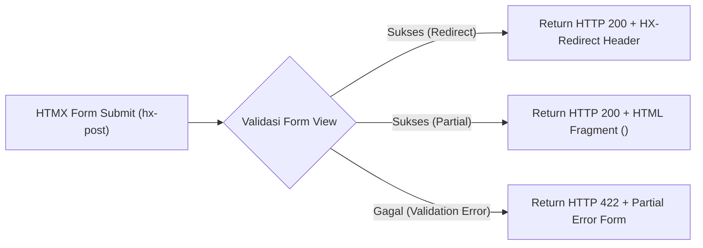

# Code Map & Tracing Matrix: UI Architecture & Components

Dokumen ini mendokumentasikan pemetaan arsitektur UI, sistem komponen **Django-Cotton**, **PicoCSS + RDP-UI Design System**, dan pola interaktivitas **HTMX**.

---

## 1. Tracing Matrix: UI Component & Render Pipeline

### A. Base Layout & CDN Layer (`US-014`) — Status: `[x] Selesai`

| Component | Template File Path | Head / Assets Loaded | Usage Syntax | Status |
|---|---|---|---|---|
| Base Layout | [templates/layout/base.html](file:///c:/Users/rahad/Work/org/rdp/starterkit/templates/layout/base.html) | PicoCSS v2, RDP-UI (`cdn.radian.web.id`), HTMX v1.9, Alpine.js v3 | `<c-layout.base title="Judul">` | `[x]` |
| App Shell / Sidebar Layout | [templates/cotton/layout/app.html](file:///c:/Users/rahad/Work/org/rdp/starterkit/templates/cotton/layout/app.html) | Responsive Sidebar, Top Navbar, User Dropdown | `<c-layout.app title="Dashboard">` | `[x]` |

---

### B. Django-Cotton Component Library (`US-015`) — Status: `[x] Selesai`

| Component Name | File Path | Props / Attributes | Output HTML Element | Status |
|---|---|---|---|---|
| `<c-rdp.button>` | `templates/cotton/rdp/button.html` | `variant`, `size`, `type`, `loading` | `<button class="rdp-btn rdp-btn--primary">` | `[x]` |
| `<c-rdp.card>` | `templates/cotton/rdp/card.html` | `title`, `footer`, `class` | `<div class="rdp-card">` | `[x]` |
| `<c-rdp.modal>` | `templates/cotton/rdp/modal.html` | `id`, `title`, `open` | `<dialog class="rdp-modal">` | `[x]` |
| `<c-rdp.badge>` | `templates/cotton/rdp/badge.html` | `variant` (success/danger/warning) | `<span class="rdp-badge">` | `[x]` |
| `<c-sidebar.brand>` | `templates/cotton/sidebar/brand.html` | `title`, `logo_url` | Brand Header | `[x]` |
| `<c-sidebar.link>` | `templates/cotton/sidebar/link.html` | `href`, `icon`, `active` | Navigation Link | `[x]` |

---

### C. HTMX Interactivity Patterns (`US-016`) — Status: `[x] Selesai`



| Pattern | View Mixin / Utility | HTTP Status Code | Response Header / Content | Status |
|---|---|---|---|---|
| Partial Form Swap | `HtmxResponseMixin` | `HTTP 200 OK` | HTML Partial Fragment | `[x]` |
| Validation Error Swap | `HtmxResponseMixin` | `HTTP 422 Unprocessable Entity` | Form dengan Error Inline | `[x]` |
| Full Page Redirect | [htmx_redirect](file:///c:/Users/rahad/Work/org/rdp/starterkit/apps/core/utils/htmx.py) | `HTTP 200 OK` | `HX-Redirect: /destination/` | `[x]` |
| Client Event Trigger | [htmx_trigger](file:///c:/Users/rahad/Work/org/rdp/starterkit/apps/core/utils/htmx.py) | `HTTP 200 OK` | `HX-Trigger: eventName` | `[x]` |

---

## 2. Struktur Folder Template & Stylesheet UI

```text
static/
├── css/
│   ├── components/            ← Styling Khusus Komponen Modular
│   │   ├── modal.css
│   │   └── sidebar.css
│   └── pages/                 ← Styling Khusus Halaman Spesifik
└── vendor/
    └── rdp-ui/                ← Local Asset Fallback (rdp.css, rdp.js)

templates/
├── cotton/                    ← Reusable Component Root Namespace
│   ├── layout/                ← Layout Templates (<c-layout.base>, <c-layout.app>)
│   ├── rdp/                   ← RDP UI Core Components (<c-rdp.button>, <c-rdp.card>)
│   └── sidebar/               ← Sidebar Navigation Components (<c-sidebar.link>)
├── errors/                    ← 403.html, 404.html, 500.html
└── partials/                  ← Page-Specific HTML Fragments untuk HTMX Swaps
```
