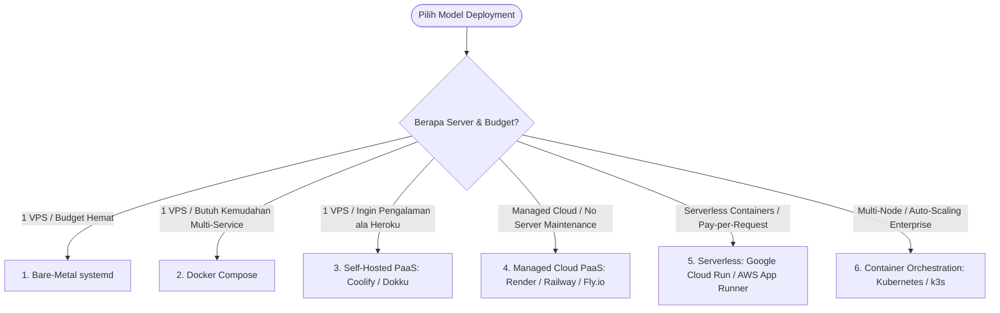
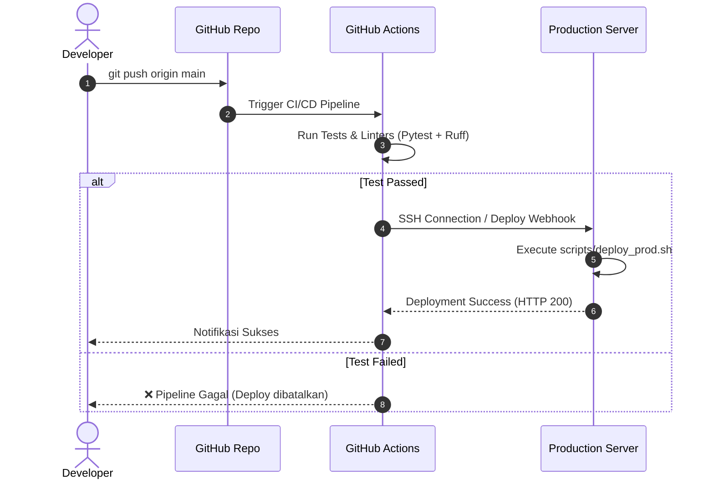

# Matriks & Opsi Lengkap Deployment — RDP Starter Kit

Dokumen ini memetakan seluruh spektrum opsi deployment yang tersedia untuk proyek RDP Starter Kit, mulai dari yang paling sederhana hingga level enterprise multi-cloud.

---

## 1. Ringkasan Seluruh Jalur Deployment

---

## 2. Rincian & Karakteristik Setiap Opsi

### 1. Bare-Metal + systemd (VPS Tradisional)
- **Cara Kerja**: Menjalankan aplikasi langsung di atas OS Linux VPS (Ubuntu/Debian) menggunakan Python virtual environment (`uv`), Gunicorn sebagai service daemon systemd, dan Nginx sebagai reverse proxy.
- **Kelebihan**: Resource overhead 0% (sangat hemat RAM/CPU), performa bare-metal tercepat.
- **Kekurangan**: Terikat pada konfigurasi OS server; perlu install ulang jika pindah server.
- **Skrip di Starterkit**: [scripts/install_service.sh](file:///scripts/install_service.sh)

---

### 2. Docker Compose (Single-VPS Containerized)
- **Cara Kerja**: Seluruh stack (Django Web, Celery, PostgreSQL, Redis, Nginx, Certbot SSL) dikemas ke dalam kontainer yang diatur oleh satu file `docker-compose.prod.yml`.
- **Kelebihan**: Paritas 100% antara Dev dan Prod, sangat mudah pindah server, isolasi dependency.
- **Kekurangan**: Ada overhead kecil memori Docker (~50-100MB).
- **Skrip di Starterkit**: [scripts/setup_docker_prod.sh](file:///scripts/setup_docker_prod.sh) & [docker-compose.prod.yml](file:///docker-compose.prod.yml)

---

### 3. Self-Hosted PaaS (Coolify / Dokku / CapRover)
- **Cara Kerja**: Anda memasang platform PaaS open-source di VPS Anda sendiri. Pengalaman seperti Heroku/Vercel (Dashboard web UI modern, auto SSL, auto deployment via Git push / GitHub webhook, managed database 1-klik).
- **Kelebihan**:
  - Dashboard visual yang sangat elegan untuk mengelola banyak aplikasi di 1 VPS.
  - Deployment otomatis setiap kali ada `git push` ke branch `main`.
  - Manajemen database, Redis, rollback, dan SSL terotomatisasi via UI.
- **Cocok Untuk**: Tim pengembang yang ingin kemudahan seperti Heroku tanpa biaya langganan bulanan mahal.

---

### 4. Managed Cloud PaaS (Render / Railway / Fly.io / DigitalOcean App Platform)
- **Cara Kerja**: Tidak perlu mengelola VPS sama sekali. Cukup hubungkan repositori GitHub Anda ke penyedia PaaS.
- **Kelebihan**:
  - Zero DevOps: Tidak perlu repot urus update OS Linux, firewall, atau konfigurasi Nginx.
  - Otomatis membuat URL HTTPS dan managed PostgreSQL/Redis.
- **Kekurangan**: Biaya bulanan meningkat seiring pertambahan resource (berdasarkan CPU/RAM per jam).
- **Cocok Untuk**: MVP cepat, demo ke klien, atau produk tahap awal yang mengutamakan kecepatan rilis.

---

### 5. Serverless Containers (Google Cloud Run / AWS App Runner)
- **Cara Kerja**: Image Docker aplikasi dideploy ke layanan Serverless Container di cloud (GCP / AWS).
- **Kelebihan**:
  - **Scale to Zero**: Jika tidak ada pengunjung (misal malam hari), kontainer otomatis mati sehingga biaya menjadi Rp 0.
  - **Auto-Scaling Instan**: Jika traffic melonjak tiba-tiba, cloud otomatis menduplikasi kontainer menjadi puluhan instance dalam hitungan detik.
  - Sangat handal untuk traffic yang fluktuatif atau tidak menentu.
- **Kekurangan**: Membutuhkan database cloud terpisah (seperti Google Cloud SQL / AWS RDS).

---

### 6. Full Orchestration: Kubernetes (K8s) / Lightweight K8s (k3s)
- **Cara Kerja**: Mengelola cluster berisi banyak server fisik/VM secara terpadu dengan auto-healing, auto-scaling horizontal (HPA), dan rolling deployment tanpa downtime.
- **Kelebihan**: Standar industri tertinggi untuk high availability, multi-region, dan multi-node.
- **Kekurangan**: Sangat kompleks dalam hal konfigurasi networking, ingress, dan pemeliharaan cluster.
- **Cocok Untuk**: Perusahaan dengan tim DevOps dedicated yang menangani traffic jutaan pengguna aktif.

---

### 7. Otomatisasi Pipeline CI/CD (GitHub Actions)
Apapun opsi hosting yang Anda pilih (Bare-Metal, Docker Compose, atau PaaS), deployment sebaiknya diotomatisasi melalui **GitHub Actions** sehingga developer tidak perlu login SSH manual ke server:

---

## 3. Matriks Perbandingan & Rekomendasi Pemilihan

| Jalur Deployment | Biaya Infra | Kemudahan Setup | Fleksibilitas | Skalabilitas | Rekomendasi Penggunaan |
|---|---|---|---|---|---|
| **Bare-Metal + systemd** | 🟢 Sangat Murah ($3-$6/bln) | 🟢 Mudah (1 Skrip) | 🟡 Terikat OS | 🟡 Vertikal (Scale Up) | VPS kecil (RAM 1GB), efisiensi maksimal. |
| **Docker Compose** | 🟢 Murah ($5-$12/bln) | 🟢 Mudah (1 Skrip) | 🟢 Sangat Portabel | 🟡 Vertikal (Scale Up) | **Standar terbaik untuk SaaS / produk baru.** |
| **Self-Hosted (Coolify)** | 🟢 Murah ($5-$20/bln) | 🟢 Sangat Mudah (Web UI) | 🟢 Sangat Portabel | 🟡 Vertikal | Ingin dashboard visual ala Heroku di VPS sendiri. |
| **Managed PaaS (Render/Railway)** | 🟡 Sedang ($7-$50+/bln) | 🟢 Instan (No-Ops) | 🟡 Terikat Platform | 🟢 Auto Scale | Butuh cepat online tanpa kelola Linux sama sekali. |
| **Serverless (Cloud Run)** | 🟢 Sangat Murah - Sedang (Pay per use) | 🟡 Sedang (Dockerfile + Cloud) | 🟢 Standar OCI | 🟢 Auto Scale Instan | Traffic fluktuatif, efisiensi scale-to-zero. |
| **Kubernetes (k3s / K8s)** | 🔴 Mahal ($50-$500+/bln) | 🔴 Rumit | 🟢 Sangat Fleksibel | 🟢 Multi-Node Enterprise | Sistem besar, multi-tim, traffic jutaan user. |
