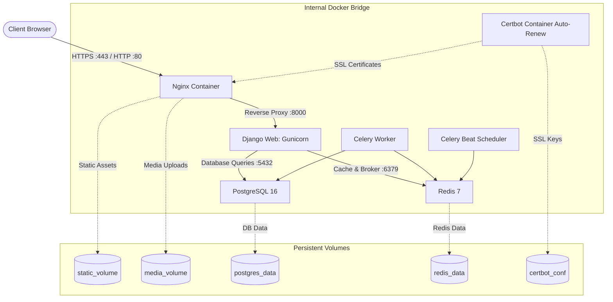

# Panduan Deployment Production: Docker Compose + SSL (Let's Encrypt)

Dokumen ini menjelaskan cara melakukan deployment RDP Starter Kit di lingkungan **Production** menggunakan **Docker Compose**, mencakup isolasi proses kontainer, WSGI server Gunicorn, reverse proxy Nginx, dan otomatisasi sertifikat SSL HTTPS gratis dari Let's Encrypt via Certbot.

---

## 1. Arsitektur Docker Compose Production



---

## 2. Struktur File Production Docker

```
rdp-starterkit/
├── Dockerfile                   # Multi-stage build (uv + Python 3.12 + non-root user)
├── .dockerignore                # Mengabaikan venv, cache, git, logs
├── docker-compose.prod.yml      # Definisi seluruh kontainer production
├── nginx/
│   └── nginx.conf               # Nginx reverse proxy + SSL configuration
├── scripts/
│   ├── setup_docker_prod.sh     # Skrip otomatisasi inisialisasi awal & request SSL
│   └── docker_deploy_prod.sh    # Skrip pembaruan rutin (git pull + rebuild)
└── .env                         # Konfigurasi environment aman (mode 600)
```

---

## 3. Cara Menjalankan (Otomatisasi Penuh)

### A. Inisialisasi Pertama Kali & Pemasangan SSL
Pastikan server Linux sudah terpasang Docker dan Docker Compose. Jalankan skrip interaktif:

```bash
# Berikan izin eksekusi
chmod +x scripts/setup_docker_prod.sh scripts/docker_deploy_prod.sh bin/deploy.sh

# Jalankan skrip setup Docker
./scripts/setup_docker_prod.sh
```
Atau melalui menu interaktif:
```bash
./bin/deploy.sh
# Pilih: 8) Setup Docker Compose Production & SSL (Let's Encrypt)
```

Skrip ini akan:
1. Meminta input domain (misal: `app.perusahaan.com`) dan email admin.
2. Membentuk konfigurasi `.env` production secara aman dengan kata sandi database acak.
3. Membangun image Docker immutable multi-stage dengan dependensi `uv`.
4. Membuat sertifikat SSL dummy sementara agar Nginx dapat aktif.
5. Meminta sertifikat SSL resmi ke Let's Encrypt via ACME HTTP challenge.
6. Menjalankan migrasi database dan `collectstatic` secara otomatis.

---

### B. Pembaruan Rutin Kode (Continuous Deployment)
Ketika ada pembaruan kode di branch `main`, lakukan update tanpa downtime panjang:

```bash
bash scripts/docker_deploy_prod.sh
```
Atau via menu:
```bash
./bin/deploy.sh
# Pilih: 9) Deploy Pembaruan Docker Production (Pull, Rebuild, Restart)
```

---

## 4. Konfigurasi Layanan di `docker-compose.prod.yml`

| Layanan | Image / Build | Peran |
|---|---|---|
| `web` | Multi-stage runtime | Menjalankan Gunicorn WSGI dengan `--workers 4`, auto-migrate, dan auto-collectstatic. |
| `celery_worker` | Multi-stage runtime | Memproses tugas asinkron (pengiriman email, bulk import CSV). |
| `celery_beat` | Multi-stage runtime | Penjadwal tugas periodik berkala. |
| `db` | `postgres:16-alpine` | Database relasional dengan healthcheck bawaan. |
| `redis` | `redis:7-alpine` | Cache in-memory dan message broker untuk Celery. |
| `nginx` | `nginx:alpine` | Reverse proxy HTTP/HTTPS, SSL termination, dan direct static/media serving. |
| `certbot` | `certbot/certbot` | Daemon perpanjangan otomatis (*auto-renewal*) sertifikat SSL setiap 12 jam. |

---

## 5. Perintah Manajemen & Operasional Docker

```bash
# Melihat status seluruh kontainer
docker compose -f docker-compose.prod.yml ps

# Melihat live logs gabungan
docker compose -f docker-compose.prod.yml logs -f

# Melihat live logs service tertentu (misal: web atau nginx)
docker compose -f docker-compose.prod.yml logs -f web

# Membuat akun superuser Django di dalam kontainer
docker compose -f docker-compose.prod.yml exec web python manage.py createsuperuser

# Menjalankan Django shell
docker compose -f docker-compose.prod.yml exec web python manage.py shell

# Backup database PostgreSQL
docker compose -f docker-compose.prod.yml exec db pg_dump -U rdpuser rdp_db | gzip > backup_$(date +%Y%m%d).sql.gz

# Memulihkan (Restore) database
gunzip < backup_20260814.sql.gz | docker compose -f docker-compose.prod.yml exec -T db psql -U rdpuser rdp_db
```
