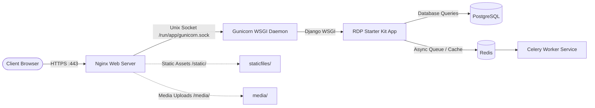

# Panduan Setup Linux Production Service (Gunicorn + Nginx + SSL)

Dokumen ini menjelaskan cara mengonfigurasi dan menjalankan aplikasi RDP Starter Kit sebagai **systemd service** di server Linux (Ubuntu/Debian) di balik **Nginx Reverse Proxy** dengan **SSL gratis otomatis dari Let's Encrypt (Certbot)**.

---

## 1. Arsitektur Deployment Bare-Metal



---

## 2. Otomatisasi Instalasi (Rekomendasi)

Tersedia skrip instalasi interaktif yang mengotomatisasi seluruh proses:

```bash
# Berikan izin eksekusi
chmod +x scripts/install_service.sh scripts/deploy_prod.sh bin/deploy.sh

# Jalankan skrip installer
./scripts/install_service.sh
```
Atau melalui menu interaktif:
```bash
./bin/deploy.sh
# Pilih Menu: 6) Setup Linux Service (Gunicorn + Nginx + SSL)
```

Skrip ini akan secara otomatis melakukan:
1. Validasi dependensi sistem (`uv`, `python`, `nginx`, `certbot`).
2. Sinkronisasi dependensi virtual environment via `uv sync --no-dev`.
3. Migrasi database (`python manage.py migrate --noinput`).
4. Pengumpulan file statis (`python manage.py collectstatic --noinput`).
5. Pembuatan file service systemd `/etc/systemd/system/<app_name>-gunicorn.service`.
6. Pembuatan konfigurasi Nginx `/etc/nginx/sites-available/<app_name>` dan symlink ke `sites-enabled/`.
7. Opsi aktivasi SSL via Certbot (`certbot --nginx -d <domain>`).
8. Pemuatan ulang (*reload*) systemd dan Nginx.

---

## 3. Detail Konfigurasi Manual

Jika Anda ingin memeriksa atau menyesuaikan konfigurasi secara manual:

### A. Systemd Service Unit (`/etc/systemd/system/rdp-gunicorn.service`)
```ini
[Unit]
Description=Gunicorn daemon for RDP Starter Kit
After=network.target

[Service]
Type=notify
User=rdpapp
Group=rdpapp
WorkingDirectory=/home/rdpapp/apps/starterkit
EnvironmentFile=/home/rdpapp/apps/starterkit/.env
ExecStart=/home/rdpapp/apps/starterkit/.venv/bin/gunicorn \
    config.wsgi:application \
    --workers 4 \
    --bind unix:/run/rdp-starter/gunicorn.sock \
    --access-logfile /home/rdpapp/apps/starterkit/logs/gunicorn-access.log \
    --error-logfile /home/rdpapp/apps/starterkit/logs/gunicorn-error.log \
    --timeout 90
ExecReload=/bin/kill -s HUP $MAINPID
KillMode=mixed
TimeoutStopSec=10
PrivateTmp=true
RuntimeDirectory=rdp-starter
Restart=on-failure
RestartSec=5

[Install]
WantedBy=multi-user.target
```

### B. Konfigurasi Nginx Reverse Proxy (`/etc/nginx/sites-available/rdp-starter`)
```nginx
upstream rdp_gunicorn {
    server unix:/run/rdp-starter/gunicorn.sock fail_timeout=0;
}

server {
    listen 80;
    server_name app.example.com;

    client_max_body_size 25M;

    # File statis langsung dilayani oleh Nginx dengan cache header
    location /static/ {
        alias /home/rdpapp/apps/starterkit/staticfiles/;
        expires 30d;
        add_header Cache-Control "public, immutable";
    }

    # Direktori media unggahan user
    location /media/ {
        alias /home/rdpapp/apps/starterkit/media/;
    }

    # Blokir akses langsung ke berkas sensitif
    location ~ /\.(env|git|py|sqlite3) {
        deny all;
        return 404;
    }

    # Forward ke Gunicorn WSGI
    location / {
        proxy_pass http://rdp_gunicorn;
        proxy_set_header Host $host;
        proxy_set_header X-Real-IP $remote_addr;
        proxy_set_header X-Forwarded-For $proxy_add_x_forwarded_for;
        proxy_set_header X-Forwarded-Proto $scheme;
        proxy_redirect off;
        proxy_read_timeout 90;
        proxy_connect_timeout 90;
    }
}
```

### C. Pemasangan SSL Let's Encrypt (Certbot)
```bash
sudo certbot --nginx -d app.example.com
```

---

## 4. Alur Pembaruan Kode di Production (Continuous Update)

Setelah service terpasang, pembaruan versi atau perbaikan bug di server production cukup dilakukan dengan satu perintah:

```bash
bash scripts/deploy_prod.sh <app_name>
```

Alur otomatis skrip:
1. `git pull origin main` (Mengambil commit terbaru).
2. `uv sync --no-dev` (Memperbarui dependensi jika ada).
3. `uv run python manage.py migrate --noinput` (Menjalankan migrasi database).
4. `uv run python manage.py collectstatic --noinput` (Memperbarui static assets).
5. `sudo systemctl restart <app_name>-gunicorn` (Restart WSGI zero-downtime).
6. `sudo systemctl reload nginx` (Reload Nginx config jika diperlukan).

---

## 5. Perintah Manajemen Operasional

| Kebutuhan | Perintah Terminal |
|---|---|
| Cek status service Gunicorn | `sudo systemctl status <app_name>-gunicorn` |
| Restart service Gunicorn | `sudo systemctl restart <app_name>-gunicorn` |
| Pantau live log aplikasi | `sudo journalctl -u <app_name>-gunicorn -f` |
| Pantau access & error log | `tail -f logs/gunicorn-access.log logs/gunicorn-error.log` |
| Uji & reload Nginx | `sudo nginx -t && sudo systemctl reload nginx` |
| Periksa masa berlaku SSL | `sudo certbot certificates` |
