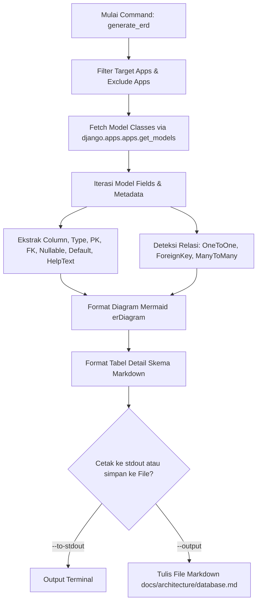

# Modul Spec: ERD Analyzer & Generator (`generate_erd`)

Dokumen ini menjelaskan arsitektur teknis dan cara kerja internal dari modul **ERD Analyzer & Generator** di RDP Starter Kit.

---

## 📌 Deskripsi Modul

Modul `generate_erd` bertindak sebagai alat introspeksi skema database terintegrasi yang membaca metadata `django.apps.apps` dan atribut `_meta` dari setiap model Django untuk menyusun representasi ERD dalam format **Markdown** dan **Mermaid ERD (`erDiagram`)**.

- **File Utama**: `apps/core/management/commands/generate_erd.py`
- **CLI Alias**: `rdp generate-erd` / `rdp erd`
- **Unit Test**: `tests/test_generate_erd.py`

---

## 🏗️ Alur Introspeksi Model

---

## 🛠️ Pemetaan Tipe Data & Relasi

| Django Model Field | Tipe Data Mermaid | Pemetaan Key | Notation Mermaid |
|---|---|---|---|
| `AutoField` / `BigAutoField` | `bigint` | **PK** | Attributes |
| `CharField` / `TextField` | `string` / `text` | `-` | Attributes |
| `IntegerField` / `DecimalField` | `int` / `decimal` | `-` | Attributes |
| `BooleanField` / `DateTimeField` | `bool` / `datetime` | `-` | Attributes |
| `ForeignKey` | `bigint` | **FK** | `Target ||--o{ Source` |
| `OneToOneField` | `bigint` | **FK** | `Target ||--|| Source` |
| `ManyToManyField` | `ManyToManyField` | **M2M** | `Source }o--o{ Target` |

---

## 🧪 Pengujian & Penjaminan Kualitas

Modul ini diuji secara otomatis via `pytest` di `tests/test_generate_erd.py` untuk memastikan:
1. Sintaks Mermaid yang dihasilkan valid dan bebas dari syntax error.
2. Filter `--apps` membatasi pengeluaran model secara akurat.
3. Penulisan ke file Markdown dan cetakan stdout berjalan tanpa kesalahan pengodean (unicode stream encoding safe).
