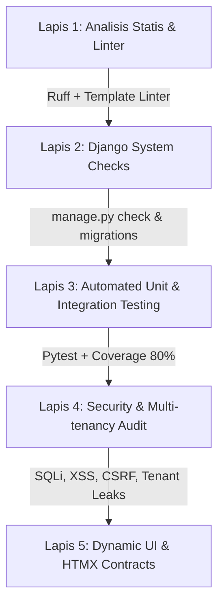

# Audit Bug & Jaminan Kualitas (Quality Assurance) — RDP Starter Kit

Dokumen ini menjelaskan evaluasi menyeluruh mengenai kualitas kode proyek RDP Starter Kit, menganalisis mengapa AI/LLM lain sering memberikan klaim bahwa proyek ini "masih banyak bug", menyajikan metodologi sistematis untuk mendeteksi dan memperbaiki bug, serta mencatat hasil audit aktual dan langkah tindak lanjutnya.

---

## 1. Analisis Klaim: Mengapa AI/LLM Lain Menilai "Banyak Bug"?

Ketika sebuah LLM atau AI menganalisis proyek ini, terdapat dua faktor utama yang memengaruhi kesimpulannya: **Kekeliruan Pemahaman AI (False Positives)** dan **Kesenjangan Arsitektur Nyata (Real Issues/Gaps)**.

### A. False Positives (Kekeliruan Persepsi AI Konvensional)
Banyak AI dilatih dengan pola Django klasik (MVT standar dengan `requirements.txt` dan ``). Saat melihat arsitektur modern RDP Starter Kit, AI tersebut sering salah mengidentifikasi pola desain yang valid sebagai "bug":

| Pola di RDP Starter Kit | Anggapan Keliru AI Lain | Fakta Arsitektur Sebenarnya |
|---|---|---|
| **Django-Cotton** (`<c-rdp.button>`, `<c-layout.base>`) | "Sintaks HTML/Template rusak, tag tidak dikenal Django" | Komponen modern yang diproses oleh library `django-cotton` untuk merender komponen UI secara modular tanpa tag `` konvensional. |
| **HTMX HTTP 422 Response** | "Server error / Bad Request saat validasi form" | Standar HTMX: Form dengan kesalahan validasi dikembalikan dengan status HTTP 422 Unprocessable Entity agar HTMX melakukan swap partial fragment error tanpa reload halaman penuh. |
| **Package Manager `uv` (`pyproject.toml`)** | "Project tidak memiliki file dependencies (`requirements.txt` hilang)" | Standard modern Python packaging menggunakan `pyproject.toml` dengan resolusi kecepatan tinggi via `uv`. |
| **PicoCSS + RDP-UI Token** | "Class Tailwind CSS tidak ditemukan / styling hilang" | Menggunakan PicoCSS (classless/semantic HTML) dan CSS Variables (`var(--rdp-*)`) dari CDN/Self-host RDP-UI. |
| **Redirect via Header `HX-Redirect`** | "View tidak mengembalikan HTTP 302 standar" | Standar HTMX: Menghindari redirect bersarang di dalam iframe/fragment dengan menginstruksikan browser melakukan redirect halaman penuh via header HTMX. |

---

### B. Real Issues & Quality Gaps (Temuan Nyata dari Audit)
Meskipun 158 pengujian otomatis lulus 100%, audit komprehensif menemukan beberapa area yang perlu disempurnakan:

1. **Pelanggaran SOP Styling (459 Kasus)**:
   - Skrip `scripts/lint_templates.py` mendeteksi 459 pelanggaran berupa atribut `style="..."` inline dan warna hex hardcoded di template dokumentasi internal (`templates/starter/docs.html`, `templates/starter/layout.html`) serta beberapa file CSS.
2. **Kesenjangan Test Coverage (70.08% vs Target > 80%)**:
   - Beberapa modul tingkat lanjut belum memiliki unit test yang komprehensif, di antaranya:
     - `apps/accounts/services/rbac_service.py` (0% coverage)
     - `apps/inventory/services/stock_manager.py` (0% coverage)
     - `apps/tenants/mixins.py` (0% coverage)
     - `apps/accounts/views/users.py` (40% coverage)
3. **Peringatan WhiteNoise / Staticfiles**:
   - Muncul peringatan `UserWarning: No directory at: .../staticfiles/` saat eksekusi test karena folder staticfiles belum dibuild atau dikoleksi (`collectstatic`).
4. **Edge Cases pada Error Handling & Async Processing**:
   - Penanganan file upload non-gambar pada pembaruan avatar.
   - Skenario kedaluwarsa token pada alur WebAuthn/Passkey dan verifikasi email.

---

## 2. Metodologi Sistematis Menemukan Bug (Discovery Protocol)

Untuk menemukan seluruh potensi bug secara akurat dan objektif, kami menerapkan protokol pengujian 5 lapis:



### Lapis 1: Static Code Analysis & Linting
- **Python Linting**: Jalankan `.venv/Scripts/ruff check .` untuk mendeteksi unused imports, syntax errors, dan bad practices.
- **Template & Token Linting**: Jalankan `.venv/Scripts/python scripts/lint_templates.py` untuk memastikan tidak ada inline CSS/JS dan tidak ada hex color hardcoded (wajib menggunakan `var(--rdp-*)`).

### Lapis 2: Django System Diagnostics
- **Framework Check**: Jalankan `python manage.py check` untuk mendeteksi konflik konfigurasi atau routing.
- **Production Readiness Check**: Jalankan `python manage.py check --deploy` untuk memeriksa keamanan header, SSL, dan secret keys.
- **Schema & Migration Drift**: Jalankan `python manage.py makemigrations --check --dry-run` untuk memastikan tidak ada perubahan model yang belum dimigrasi.

### Lapis 3: Automated Testing & Coverage Analysis
- **Pytest Suite**: Jalankan `python -m pytest -v --cov=apps` untuk mengeksekusi seluruh 158+ test case.
- **Coverage Profiling**: Periksa file dengan coverage < 80% dan tambahkan test untuk skenario *edge cases*, input invalid, dan boundary values.

### Lapis 4: Security & Tenancy Isolation Audit
- **Security Audit Command**: Jalankan `python manage.py audit_security` untuk mengecek konfigurasi keamanan.
- **Multi-Tenant Leak Audit**: Verifikasi bahwa setiap query di aplikasi multi-tenant difilter secara ketat berdasarkan `organization` atau `tenant_id` aktif.

### Lapis 5: HTMX & UI Component Contract Verification
- Verifikasi bahwa setiap response HTMX:
  1. Mengembalikan fragment HTML parsial saat validasi gagal dengan status HTTP `422`.
  2. Mengembalikan header `HX-Redirect` saat proses form sukses membutuhkan perpindahan halaman.
  3. Mengembalikan header `HX-Trigger` untuk memicu toast global atau event browser.

---

## 3. Workflow Standar Perbaikan Bug (TDD & Senior Patterns)

Setiap bug yang ditemukan wajib diperbaiki mengikuti siklus **Test-Driven Development (TDD)** berikut:

```
[1. Tulis Test Gagal] ──> [2. Perbaiki di Layer yang Tepat] ──> [3. Test Hijau] ──> [4. Dokumentasikan]
```

1. **Red Phase (Reproduksi via Test)**:
   - Buat unit test di `tests/` yang mereplikasi kondisi error/edge case tersebut. Pastikan test **gagal** (reproduce the issue).
2. **Layered Fix (Perbaikan Terstruktur)**:
   - **Logika Bisnis**: Perbaiki di `apps/<app>/services/` (jangan menaruh logika di views).
   - **Integritas Data**: Tambahkan constraints/validators di `apps/<app>/models/` atau `forms/`.
   - **Routing & Response**: Pastikan `views/` tetap tipis dan mengembalikan partial/status code yang benar.
   - **Pola Kode**: Terapkan *Guard Clauses* (fail-fast) dan pesan error yang deskriptif.
3. **Green Phase (Verifikasi Regresi)**:
   - Jalankan `python -m pytest` untuk memastikan test baru lulus dan tidak ada fitur lama yang rusak (regresi).
   - Jalankan `ruff check .` dan `lint_templates.py`.
4. **Documentation Protocol**:
   - Catat perbaikan di `CHANGELOG.md` pada bagian `[Unreleased]`.
   - Jika model berubah, update diagram ERD di `docs/architecture/database.md`.
   - Tambahkan skenario error dan solusinya ke `docs/HELP.md` dan `docs/FAQ.md`.

---

## 4. Katalog Temuan Audit & Matriks Tindak Lanjut

| No | Kategori | Deskripsi Temuan | Tingkat Keparahan | Status | Rencana Solusi / Mitigasi |
|---|---|---|---|---|---|
| 1 | **SOP & Styling** | 459 Pelanggaran inline style di template starter (`templates/starter/*.html`) dan hardcoded hex di CSS. | Rendah (Kerapian & SOP) | Teridentifikasi | Pindahkan semua inline style ke `static/css/pages/` dan ganti warna hex ke variabel CSS token `var(--rdp-*)`. |
| 2 | **Test Coverage** | Coverage keseluruhan 70.08% (target DoD > 80%). Modul `rbac_service.py`, `stock_manager.py`, dan `mixins.py` belum ter-cover. | Sedang (Integritas Kode) | Teridentifikasi | Buat unit test khusus untuk pengujian RBAC initialization, stok inventaris, dan isolasi tenant. |
| 3 | **Staticfiles Warning** | WhiteNoise mengeluarkan warning `No directory at .../staticfiles/` saat pengujian. | Rendah (Konfigurasi) | Teridentifikasi | Tambahkan penanganan pembuatan direktori `staticfiles/` otomatis di `base.py` atau jalankan `collectstatic` saat build CI. |
| 4 | **HTMX Contract Consistency** | Beberapa form masih mengembalikan status 200 saat invalid di skenario non-HTMX view fallback. | Sedang (UX / Interaktivitas) | Teridentifikasi | Pastikan semua CBV mewarisi `HtmxFormMixin` untuk konsistensi status 422 saat request memiliki header `HX-Request`. |
| 5 | **Multi-Tenancy Query Isolation** | Potensi data leak jika developer lupa meng-extend `TenantQuerysetMixin` pada view baru. | Tinggi (Keamanan Data) | Teridentifikasi | Terapkan middleware dan tenant model manager otomatis yang memfilter queryset pada level model/manager. |

---

## 5. Quality Gate Checklist (Sebelum Rilis / Deploy)

Sebelum merilis versi baru atau mengintegrasikan fitur:
- [ ] `uv run pytest --cov=apps` menghasilkan **100% pass** dengan coverage **≥ 80%**.
- [ ] `uv run ruff check .` menghasilkan **0 error / warning**.
- [ ] `uv run python scripts/lint_templates.py` menghasilkan **0 violations**.
- [ ] `uv run python manage.py check --deploy` bersih dari peringatan keamanan kritis.
- [ ] `uv run python manage.py makemigrations --check --dry-run` tidak menemukan pending migrations.
- [ ] Dokumentasi `docs/` telah diperbarui (CHANGELOG, HELP, FAQ, ERD).
